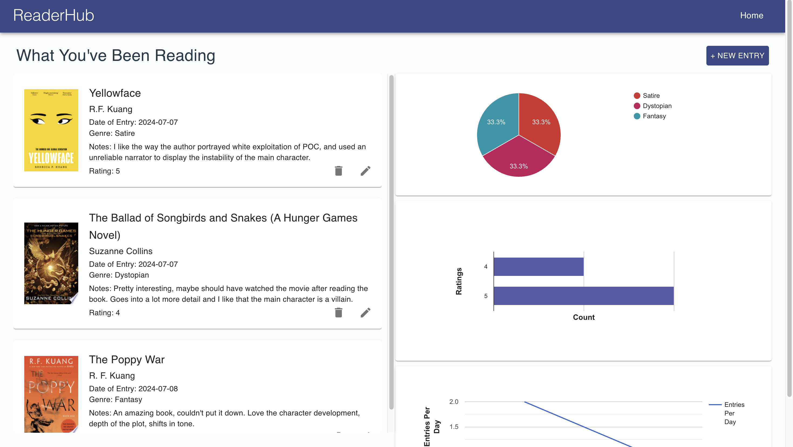
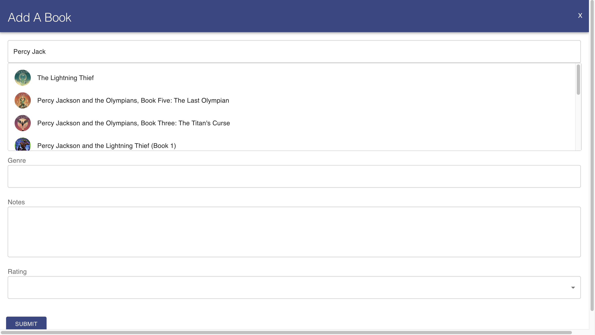
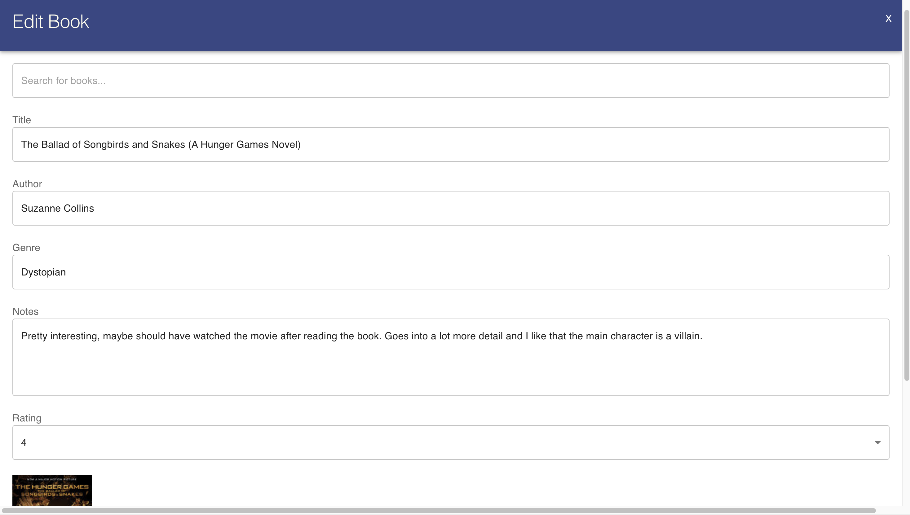

<h1>Welcome to ReaderHub!</h1> 

ReaderHub is a web app focused on tracking your personal reading journey! The goal of ReaderHub is to have a simple, elegant hub to track what you've been reading and how your habits are fluctuating through time.
On ReaderHub, you can create journal entries about the books you have read by searching for the title using Google's Books API, and then filling in the entry with your notes about the book. Once you submit your entry, you'll see that entry added to your existing list. 
You'll also see visualizations about your reading trends, including the breakdown of the genres you've read, the ratings you've given, and your reading activity through time. 

- current steps for running
- download the repository
- create local database
    - cd server
    - node database.js --> generates database.db
- navigate out of server (cd ..)
- run the following commands
    - chmod +x start.sh
    - ./start.sh

Home Page

Search for Books

Edit Entries

